```mermaid
graph TD
    %% Entry Point
    Main[main.go]
    
    %% Core Infrastructure
    Server[server]
    Middleware[middleware]
    
    %% Pkg Layer (Infrastructure)
    PkgJWT[pkg/jwt]
    PkgKeycloak[pkg/keycloak]
    PkgSecurity[pkg/security]
    PkgRouter[pkg/router]
    PkgValidator[pkg/validator]
    PkgDTO[pkg/dto]
    
    %% Auth Modules
    AuthAdmin[modules/auth/admin]
    AuthUser[modules/auth/user]
    
    %% Business Modules
    User[modules/user]
    Item[modules/item]
    Payment[modules/payment]
    Reward[modules/reward]
    Coupon[modules/coupon]
    
    %% Repository Layer
    UserRepo[modules/user/repository]
    ItemRepo[modules/item/repository]
    PaymentRepo[modules/payment/repository]
    CouponRepo[modules/coupon/repository]
    
    %% Main dependencies
    Main --> Server
    Main --> Middleware
    Main --> AuthAdmin
    Main --> AuthUser
    Main --> User
    Main --> Item
    Main --> Payment
    Main --> Reward
    Main --> Coupon
    Main --> PkgValidator
    
    %% Server dependencies
    Server --> PkgRouter
    
    %% Auth Admin dependencies
    AuthAdmin --> PkgKeycloak
    AuthAdmin --> PkgJWT
    AuthAdmin --> PkgRouter
    AuthAdmin --> PkgDTO
    AuthAdmin --> PkgValidator
    
    %% Auth User dependencies
    AuthUser --> PkgJWT
    AuthUser --> PkgRouter
    AuthUser --> PkgDTO
    AuthUser --> PkgValidator
    
    %% User module dependencies
    User --> UserRepo
    User --> PkgSecurity
    User --> PkgRouter
    User -.-> AuthUser
    
    %% Item module dependencies
    Item --> ItemRepo
    Item --> PkgRouter
    Item --> PkgValidator
    
    %% Payment module dependencies
    Payment --> PaymentRepo
    Payment --> Item
    Payment --> PkgRouter
    Payment --> PkgValidator
    
    %% Reward module dependencies
    Reward --> Item
    Reward --> Payment
    Reward --> PkgRouter
    
    %% Coupon module dependencies
    Coupon --> CouponRepo
    Coupon --> Reward
    Coupon --> PkgRouter
    Coupon --> PkgValidator
    
    %% External dependencies
    PkgJWT -.-> JWT_LIB["github.com/golang-jwt/jwt/v5"]
    PkgKeycloak -.-> HTTP_LIB["net/http"]
    PkgSecurity -.-> CRYPTO_LIB["golang.org/x/crypto/argon2"]
    PkgValidator -.-> VALIDATOR_LIB["github.com/go-playground/validator/v10"]
    
    %% Styling
    classDef entryPoint fill:#ff6b6b,stroke:#333,stroke-width:3px,color:#fff
    classDef infrastructure fill:#4ecdc4,stroke:#333,stroke-width:2px,color:#fff
    classDef business fill:#45b7d1,stroke:#333,stroke-width:2px,color:#fff
    classDef auth fill:#96ceb4,stroke:#333,stroke-width:2px,color:#fff
    classDef repository fill:#feca57,stroke:#333,stroke-width:2px,color:#fff
    classDef external fill:#ddd,stroke:#999,stroke-width:1px,color:#666
    classDef adapter stroke-dasharray: 5 5,stroke:#ff9ff3,stroke-width:2px
    
    class Main entryPoint
    class Server,Middleware infrastructure
    class PkgJWT,PkgKeycloak,PkgSecurity,PkgRouter,PkgValidator,PkgDTO infrastructure
    class User,Item,Payment,Reward,Coupon business
    class AuthAdmin,AuthUser auth
    class UserRepo,ItemRepo,PaymentRepo,CouponRepo repository
    class JWT_LIB,HTTP_LIB,CRYPTO_LIB,VALIDATOR_LIB external
```

# 모듈 의존관계 다이어그램

## 전체 의존관계 구조



## 🔍 의존관계 다이어그램 설명

### 범례
- 🔴 **빨간색 (Entry Point)**: 애플리케이션 진입점
- 🟦 **파란색 (Infrastructure)**: 인프라/공통 패키지 
- 🟢 **초록색 (Auth)**: 인증 관련 모듈
- 🟡 **노란색 (Repository)**: 데이터 레이어
- 🔵 **파란색 (Business)**: 비즈니스 로직 모듈
- 🔗 **점선**: 어댑터 패턴 또는 외부 라이브러리 의존성

### 주요 특징
1. **단방향 의존성**: 순환 의존성이 없는 깔끔한 구조
2. **레이어드 아키텍처**: Infrastructure → Business → Presentation 
3. **어댑터 패턴**: User ↔ AuthUser 간 순환 의존성 방지
4. **의존성 주입**: Fx 프레임워크를 통한 자동 의존성 관리

### 모듈별 의존성 순서
```
item (기본) → payment → reward → coupon
```

## 📋 모듈별 상세 의존관계

### Entry Point (main.go)
직접 import하는 모듈들:
- `fxserver/middleware`
- `fxserver/modules/auth`
- `fxserver/modules/coupon`  
- `fxserver/modules/item`
- `fxserver/modules/payment`
- `fxserver/modules/reward`
- `fxserver/modules/user`
- `fxserver/pkg/validator`
- `fxserver/server`

### modules/auth/admin
**Import 의존성:**
- `fxserver/pkg/keycloak` - Keycloak OAuth2 인증
- `fxserver/pkg/router` - 라우팅 인터페이스
- `fxserver/pkg/dto` - 공통 DTO
- `fxserver/pkg/validator` - 검증
- `fxserver/pkg/jwt` - JWT 토큰 서비스

**기능:** Keycloak 기반 관리자 인증 및 SSO 로그인

### modules/auth/user
**Import 의존성:**
- `fxserver/pkg/router` - 라우팅 인터페이스
- `fxserver/pkg/dto` - 공통 DTO
- `fxserver/pkg/validator` - 검증
- `fxserver/pkg/jwt` - JWT 토큰 서비스

**기능:** 일반 사용자 인증 (이메일/패스워드 로그인)

### modules/user
**Import 의존성:**
- `fxserver/modules/user/repository` - 사용자 데이터 레포지토리
- `fxserver/pkg/router` - 라우팅 인터페이스
- `fxserver/pkg/security` - 패스워드 해싱
- `fxserver/modules/auth/user` - 인증 어댑터 패턴

**특별한 관계:** `auth/user` 모듈과 **순환 의존성 방지를 위한 어댑터 패턴** 사용

### modules/item
**Import 의존성:**
- `fxserver/modules/item/repository` - 아이템 데이터 레포지토리
- `fxserver/pkg/router` - 라우팅 인터페이스

**기능:** 기본 아이템 시스템 (아이템 마스터 관리, 인벤토리 관리)

### modules/payment
**Import 의존성:**
- `fxserver/modules/payment/repository` - 결제 데이터 레포지토리
- `fxserver/pkg/router` - 라우팅 인터페이스

**기능:** 결제 처리 시스템  
**의존 관계:** `item` 모듈에 의존 (결제 시 보상 아이템 처리)

### modules/reward
**Import 의존성:**
- `fxserver/modules/item` - 아이템 서비스
- `fxserver/modules/item/entity` - 아이템 엔티티
- `fxserver/pkg/router` - 라우팅 인터페이스

**기능:** 통합 보상 시스템  
**의존 관계:** `item`, `payment` 모듈에 의존

### modules/coupon
**Import 의존성:**
- `fxserver/modules/coupon/repository` - 쿠폰 데이터 레포지토리
- `fxserver/modules/reward` - 보상 시스템
- `fxserver/pkg/router` - 라우팅 인터페이스

**기능:** 쿠폰 시스템  
**의존 관계:** `reward` 모듈에 의존하여 아이템 지급

## 🏗️ pkg 패키지별 의존관계

### pkg/jwt
**External 의존성:** `github.com/golang-jwt/jwt/v5`  
**기능:** JWT 토큰 생성/검증, 다중 토큰 타입 지원 (access, refresh, admin)

### pkg/keycloak
**기능:** Keycloak OAuth2/OIDC 클라이언트  
**의존성:** 표준 라이브러리만 사용

### pkg/security
**External 의존성:** `golang.org/x/crypto/argon2`  
**기능:** Argon2id 기반 패스워드 해싱

### pkg/router
**기능:** 라우팅 인터페이스 정의

### pkg/validator
**External 의존성:** `github.com/go-playground/validator/v10`  
**기능:** 요청 데이터 검증

### pkg/dto
**기능:** 공통 에러 응답 DTO

## 🎯 의존성 그래프 (레이어별)

```
┌─────────────┐
│   main.go   │ (Entry Point)
└─────┬───────┘
      │
┌─────▼───────┐
│  middleware │ (Cross-cutting)
│   server    │
│ pkg/validator│
└─────┬───────┘
      │
┌─────▼───────┐
│   modules   │ (Business Logic Layer)
│             │
│ ┌─────────┐ │
│ │  auth   │ │ ──┐
│ └─────────┘ │   │
│ ┌─────────┐ │   │ (어댑터 패턴)
│ │  user   │ │ ──┘
│ └─────────┘ │
│ ┌─────────┐ │
│ │  item   │ │ ──┐
│ └─────────┘ │   │
│ ┌─────────┐ │   ▼
│ │ payment │ │   │ (의존)
│ └─────────┘ │   │
│ ┌─────────┐ │   │
│ │ reward  │ │ ──┘
│ └─────────┘ │   
│ ┌─────────┐ │   │
│ │ coupon  │ │ ──┘ (의존)
│ └─────────┘ │
└─────┬───────┘
      │
┌─────▼───────┐
│   pkg/*     │ (Infrastructure Layer)
│             │
│ ┌─────────┐ │
│ │   jwt   │ │
│ └─────────┘ │
│ ┌─────────┐ │
│ │keycloak │ │
│ └─────────┘ │
│ ┌─────────┐ │
│ │security │ │
│ └─────────┘ │
│ ┌─────────┐ │
│ │ router  │ │
│ └─────────┘ │
└─────────────┘
```

## 🔄 주요 의존성 패턴

### 의존성 주입 (Dependency Injection)
- **Fx 프레임워크**를 통한 자동 의존성 주입
- 각 모듈의 `Module` 변수에서 의존성 정의
- 인터페이스 기반 설계로 느슨한 결합

### 어댑터 패턴 (Adapter Pattern)
- `modules/user/auth_adapter.go`에서 순환 의존성 방지
- `user` 모듈과 `auth/user` 모듈 간의 안전한 연결

### 레이어드 아키텍처
- **Infrastructure Layer**: pkg/* 패키지들
- **Business Logic Layer**: modules/* 패키지들
- **Presentation Layer**: handlers, middleware

## ✅ 의존성 관리의 장점

1. **단방향 의존성**: 순환 의존성이 없는 깔끔한 구조
2. **모듈화**: 각 기능별로 독립적인 모듈 구성
3. **확장성**: 새로운 모듈 추가 시 기존 코드 영향 최소화
4. **테스트 용이성**: 인터페이스 기반으로 Mock 객체 활용 가능
5. **유지보수성**: 각 모듈의 책임이 명확히 분리됨

## 📝 권장사항

1. **의존성 추가 시 주의사항**: 새로운 모듈 추가 시 기존 의존성 그래프를 고려
2. **인터페이스 활용**: 모듈 간 통신 시 인터페이스를 통한 느슨한 결합 유지
3. **순환 의존성 방지**: 어댑터 패턴이나 이벤트 기반 아키텍처 고려
4. **pkg 패키지 활용**: 공통 기능은 pkg 패키지로 분리하여 재사용성 향상

---

이 프로젝트는 **SOLID 원칙**을 잘 준수하며, 확장 가능하고 유지보수가 용이한 아키텍처를 제공합니다.